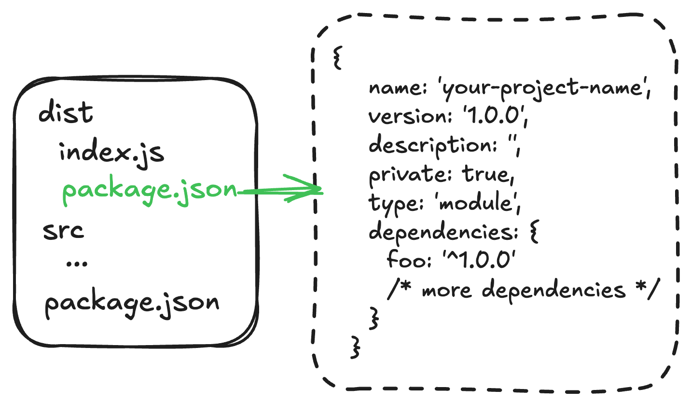

<h1 align="center">distpkg</h1>

<p align="center"><a href="./README.zh-CN.md" target="_blank">中文文档</a></p>

<p align="center">
<a href="https://npmjs.com/package/distpkg" target="_blank"></a> <a href="https://github.com/refinist/distpkg/actions/workflows/unit-test.yml" target="_blank"></a> <a href="https://codecov.io/github/refinist/distpkg" target="_blank"></a>

</p>

A tool for post-build projects (generally used after bundling into a single file with  (bun) or node, etc.), which generates a minimal package.json in the dist directory. Then, by running install again in the dist directory, it ensures that the final code can execute correctly.

<p></p>

## Why do we need to install again?

Because some packages may depend on the current environment, or some packages may only determine at runtime that they need to load their dependencies (which might be installed directly in `node_modules/some-package`). Therefore, we need to extract these "special" packages separately. For example, put foo in the dependencies of dist/package.json, so that by running install again in the dist directory, we can ensure the code executes correctly!

## Why bundle? 🤨

[Why bundle?](https://bun.sh/docs/bundler#why-bundle), let's read this article together

## Features

- 🚀 **Fast and Simple**: Quickly generate dist/package.json
- 📦 **Flexible Configuration**: Support both CLI options and config files
- 🔧 **Customizable**: Choose which package.json fields to include
- 🌟 **TypeScript Support**: Full TypeScript support with type definitions
- 📝 **Auto Sorting**: Automatically sort package.json fields, perfect for OCD
- ✅ **100% Test Coverage**: Project stability and reliability guaranteed
-  **Bun Perfect Integration**: Optimized for Bun single-file bundling, seamless integration

## Installation

```bash

# pnpm
pnpm add -D distpkg

# bun
bun add -D distpkg

# npm
npm install -D distpkg

# yarn
yarn add -D distpkg
```

## Quick Start

### Basic Usage (Only 2 Steps)

1. Configure scripts in package.json

```json
{
  "scripts": {
    "build": "pnpm run build:project && distpkg",
    "build:project": "your build command"
  }
}
```

2. Configure distpkg.config.ts

```typescript
// distpkg.config.ts
import { defineConfig } from 'distpkg';

export default defineConfig({
  packageJson: {
    dependencies: {
      foo: '^1.0.0'
      /* more dependencies */
    }
  }
});
```

> [!TIP]
> When building your project, you should exclude the foo package, such as `"build": "bun build src/index.ts --target bun --outdir=dist --bytecode --minify --external foo"`

## CLI Options

```
Usage:
  $ distpkg [...package-keys]

Commands:
  [...package-keys]  Keys to copy from project package.json to dist/package.json

For more info, run any command with the `--help` flag:
  $ distpkg --help

Options:
  -c, --config <filename>  Use a custom config file
  -d, --out-dir <dir>      Output directory (default: dist)
  --cwd <dir>              Working directory (default: process.cwd())
  -s, --sort               Sort package.json (default: true)
  -h, --help               Display this message
  -v, --version            Display version number
```

### Programmatic Usage

```typescript
import { build } from 'distpkg';

// your build js
// ...
const result = await build({
  /* ... */
});
if (!result.success) {
  console.error('Build failed with errors:', result.message);
}
```

## Docker Deployment

With this tool, our project best practices should be as follows (personal opinion only):

install -> build -> cd dist -> install -> package into image -> deploy to docker -> deploy successfully and start service

## License

[MIT](./LICENSE)

Copyright (c) 2025-present, Zhifeng (Jeff) Wang
