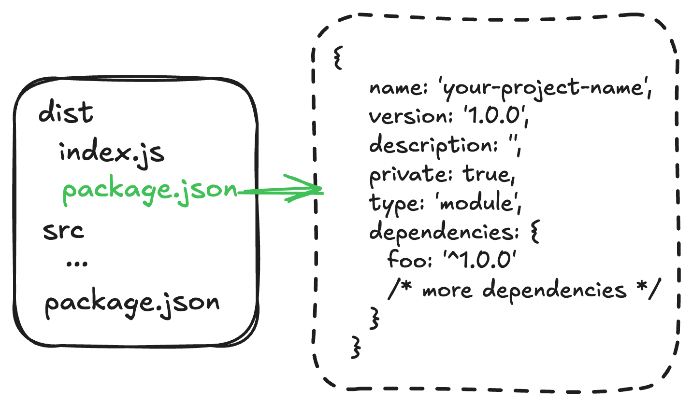

<h1 align="center">distpkg</h1>

<p align="center"><a href="./README.md" target="_blank">English Document</a></p>

<p align="center">
<a href="https://npmjs.com/package/distpkg" target="_blank"></a> <a href="https://github.com/refinist/distpkg/actions/workflows/unit-test.yml" target="_blank"></a> <a href="https://codecov.io/github/refinist/distpkg" target="_blank"></a>

</p>

一个项目构建后的工具（一般用于(bun) 或者 node 等，打包成单文件后使用），在 dist 目录中生成精简的 package.json，然后在 dist 目录下通过再一次的 install 确保最终的代码可以执行正确

<p></p>

## 为什么需要在 install 一次？

因为可能存在部分的包依赖了当下的环境，我们把这些包单独拿出来，比如 foo，放在 dist/package.json 的 dependencies 中，这样在 dist 目录下通过再一次的 install 就可以确保代码执行正确！

## 为什么要打包？🤨

[Why bundle?](https://bun.sh/docs/bundler#why-bundle)，让我们一起阅读这篇文章

## 特性

- 🚀 **快速简单**: 快速生成 dist/package.json
- 📦 **灵活配置**: 支持命令行选项和配置文件
- 🔧 **可定制**: 选择要包含的 package.json 字段
- 🌟 **TypeScript 支持**: 完整的 TypeScript 支持和类型定义
- 📝 **自动排序**: 自动排序 package.json 字段，适合强迫症
- ✅ **100% 测试覆盖率**: 项目稳定可靠，质量有保障
-  **Bun 完美适配**: 专为 Bun 单文件打包优化，无缝集成

## 安装

```bash

# pnpm
pnpm add -D distpkg

# bun
bun add -D distpkg

# npm
npm install -D distpkg

# yarn
yarn add -D distpkg
```

## 快速开始

### 基本用法 (只需两步)

1. 配置 package.json 中的 scripts

```json
{
  "scripts": {
    "build": "pnpm run build:project && distpkg",
    "build:project": "your build command"
  }
}
```

2. 配置 distpkg.config.ts

```typescript
// distpkg.config.ts
import { defineConfig } from 'distpkg';

export default defineConfig({
  packageJson: {
    name: 'your-project-name',
    version: '1.0.0',
    description: 'your-project-description',
    private: true,
    type: 'module',
    dependencies: {
      foo: '^1.0.0'
      /* more dependencies */
    }
  }
});
```

> [!TIP]
> 在项目构建的时候，你应该排除 foo 包，如 `"build": "bun build src/index.ts --target bun --outdir=dist --bytecode --minify --external foo"`

## 命令行选项

```
Usage:
  $ distpkg [...package-keys]

Commands:
  [...package-keys]  Keys to copy from project package.json to dist/package.json

For more info, run any command with the `--help` flag:
  $ distpkg --help

Options:
  -c, --config <filename>  Use a custom config file
  -d, --out-dir <dir>      Output directory (default: dist)
  --cwd <dir>              Working directory (default: process.cwd())
  -s, --sort               Sort package.json (default: true)
  -h, --help               Display this message
  -v, --version            Display version number
```

### 编程方式使用

```typescript
import { build } from 'distpkg';

// your build js
// ...
const result = await build({
  /* ... */
});
if (!result.success) {
  console.error('Build failed with errors:', result.message);
}
```

## docker 部署

有了这个工具之后，我们的项目最佳实践应该如下（仅表示我个人）：

install -> build -> cd dist -> install -> 打包成镜像 -> 部署到 docker -> 部署成功启动服务

## License

[MIT](./LICENSE)

Copyright (c) 2025-present, Zhifeng (Jeff) Wang
